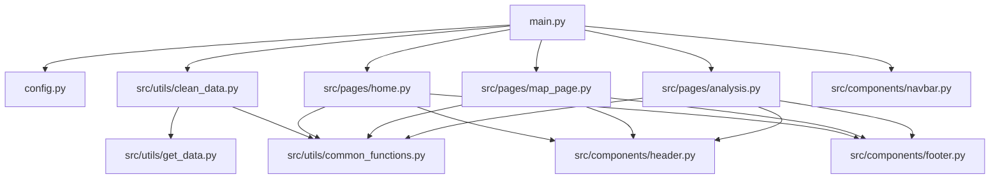

# Chutes de Météorites – Dashboard d'Analyse Mondiale

Dashboard interactif développé dans le cadre du projet E4-DSIA Python 2 – ESIEE Paris.  
Il explore **45 000+ météorites** répertoriées par la *Meteoritical Society* et la NASA.

---

## User Guide

### Prérequis

- Python **3.10+**
- Connexion internet (uniquement pour le premier téléchargement des données)

### Démonstration vidéo

 **Vidéo disponible ici :** [Dashboard Météorites](https://youtu.be/xQYxJx4o6L4)

### Installation

```bash
# 1. Cloner le dépôt
git clone <adresse_publique_du_projet>
# https://github.com/VolcyDes/Meteorites_Landings 
cd meteorite_project

# 2. Installer les dépendances avec uv
uv sync

# 3. Lancer le dashboard
uv run python main.py
```

Le dashboard est alors accessible sur **http://127.0.0.1:8050**.

> **Note :** À la première exécution, les données sont téléchargées et nettoyées automatiquement.  
> Vous pouvez aussi les régénérer manuellement :  
> `uv run python -m src.utils.clean_data`

### Utilisation

| Page | URL | Description |
|------|-----|-------------|
| Accueil | `/` | KPIs, répartition Fell/Found, top classes |
| Carte mondiale | `/carte` | Scatter map interactive avec filtres dynamiques |
| Analyses | `/analyses` | Histogramme, évolution temporelle, catégories de masse |

---

## Data

**Source :** [NASA Open Data Portal – Meteorite Landings](https://data.nasa.gov/dataset/meteorite-landings)  
**Producteur :** The Meteoritical Society  
**Licence :** Domaine public (Open Data)  
**API directe :**
```
https://data.nasa.gov/docs/legacy/meteorite_landings/Meteorite_Landings.csv
```

### Variables principales

| Colonne | Description |
|---------|-------------|
| `nom` | Nom officiel de la météorite |
| `classe` | Classification pétrographique (ex. L5, H6…) |
| `masse_g` | Masse en grammes |
| `statut` | `Fell` (observée tomber) ou `Found` (trouvée) |
| `annee` | Année de découverte/chute |
| `latitude` / `longitude` | Coordonnées GPS du point de chute |

---

## Developer Guide

### Architecture du code



### Ajouter une page

1. Créer `src/pages/ma_page.py` avec une fonction `layout() -> html.Div`.
2. Importer la page dans `main.py` : `from src.pages import ma_page`.
3. Ajouter un `elif pathname == "/ma-page": return ma_page.layout()` dans `display_page()`.
4. Ajouter le lien dans `src/components/navbar.py`.

### Ajouter un graphique

Dans la page concernée, créer une fonction `_fig_mon_graphique(df) -> go.Figure`  
et l'appeler dans `layout()` ou via un `@callback`.

---

## Rapport d'analyse

### Principales conclusions

**1. La grande majorité des météorites est trouvée, non observée.**  
Seulement ~1 100 météorites ont été directement observées lors de leur chute (*Fell*), contre ~44 000 retrouvées sur le terrain (*Found*). Cela s'explique par la concentration des expéditions de collecte en Antarctique et dans les déserts.

**2. La distribution des masses suit une loi de puissance.**  
L'histogramme en échelle logarithmique révèle que la très grande majorité des météorites pèse moins de 1 kg, tandis que les géantes (>1 tonne) sont  extrêmement rares. La météorite Hoba (Namibie) détient le record avec **60 000 kg**.

**3. L'explosion des découvertes à partir des années 1970.**  
La courbe temporelle montre une croissance spectaculaire liée au lancement des programmes de collecte systématique en Antarctique (ANSMET, 1976) et dans les déserts chauds (Sahara, Atacama).

**4. Les chondrites L et H dominent largement.**  
Les classes L5, L6, H5 et H6 représentent plus de 50 % du catalogue. Ce sont des chondrites ordinaires, issues de la ceinture d'astéroïdes.

**5. Répartition géographique non uniforme.**  
La carte révèle des concentrations en Antarctique, dans le désert du Sahara et en Oman, reflets des zones de collecte intensives plutôt que d'une répartition naturelle des impacts.

---

## Copyright

Le code fourni a été produit par nous-mêmes, à l'exception des lignes ci-dessous :

| Lignes / Fichier | Source | Explication |
|------------------|--------|-------------|
| `pd.cut()` dans `clean_data.py` | [doc pandas](https://pandas.pydata.org/docs/reference/api/pandas.cut.html) | Discrétisation de la masse en catégories (`MASS_BINS` / `MASS_LABELS`) |
| `pd.to_numeric(..., errors="coerce")` dans `clean_data.py` | [doc pandas](https://pandas.pydata.org/docs/reference/api/pandas.to_numeric.html) | Conversion sécurisée des colonnes `masse_g` et `annee` avec gestion des valeurs non numériques |
| `@functools.lru_cache(maxsize=1)` dans `common_functions.py` | [doc Python](https://docs.python.org/3/library/functools.html#functools.lru_cache) | Mise en cache des DataFrames pour éviter de relire le disque à chaque callback |
| `go.Scattergeo()` dans `map_page.py` | [doc Plotly](https://plotly.com/python/scatter-plots-on-maps/) | Carte scatter géographique avec marqueurs colorés par masse |
| `go.Scatter(..., fill="tozeroy")` dans `analysis.py` | [doc Plotly](https://plotly.com/python/filled-area-plots/) | Courbe temporelle avec aire remplie sous la ligne |
| Structure routing `dcc.Location` dans `main.py` | [doc Dash](https://dash.plotly.com/urls) | Navigation multi-pages avec URL et callback sur `pathname` |
| `requests.get(..., timeout=30)` dans `get_data.py` | [doc requests](https://requests.readthedocs.io/en/latest/user/quickstart/#make-a-request) | Téléchargement du CSV NASA avec gestion du timeout et de `raise_for_status()` |
| `df.to_sql()` / `pd.read_sql_query()` dans `clean_data.py` / `common_functions.py` | [doc pandas SQLite](https://pandas.pydata.org/docs/reference/api/pandas.DataFrame.to_sql.html) | Persistance et lecture du DataFrame via SQLite |